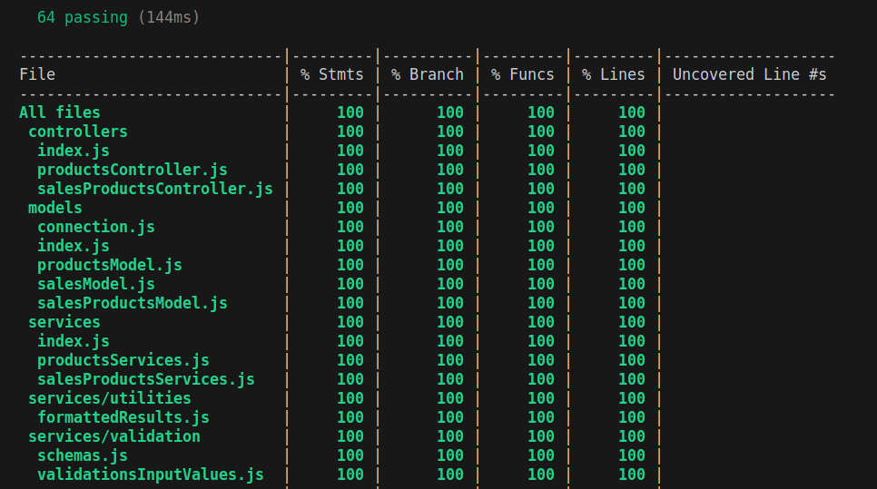

<h1 align="center">Boas-vindas ao repositório do Store Manager!</h1>

<h2 align="center">
  <a href="https://store-manager.up.railway.app/doc" target="_blank">
    Swagger
  </a>
</h2>
<br/>

## Objetivo

<strong>Store Manager</strong> é uma API de gerenciamento de vendas em formato dropshipping, que permite a realização de operações CRUD (Create, Read, Update e Delete). A aplicação segue a arquitetura MSC.

## O que foi desenvolvido?

<strong>Store Manager</strong> é uma API de sistema de gerenciamento de vendas no formato dropshipping, capaz de realizar operações de CRUD (Create, Read, Update e Delete) utilizando a arquitetura MSC. O uso do docker permitiu a criação de dois containers: um para rodar o código javascript fora do navegador com o node.js, e outro para disponibilizar o banco de dados mySQL para a aplicação.

O projeto foi escrito em javascript, com o framework express.js sendo utilizado para administrar as rotas, executar o tratamento das requisições HTTP e implementar os middlewares. A biblioteca joi foi responsável por realizar as validações dos dados enviados no corpo das requisições.

Os endpoints são capazes de realizar operações de CRUD tanto para vendas quanto para produtos. Para garantir a qualidade do código, foram escritos testes de unidade usando mocha, chai e sinon, alcançando uma taxa de cobertura de 100% da aplicação. O desenvolvimento foi realizado com base no método de desenvolvimento orientado a testes (TDD).

## Linguagens e ferramentas
- Docker
- Node.js
- Javascript
- Express.js
- MySQL
- Mocha
- Chai
- Sinon

## Instalação e execução com docker

### 1 - Clone o repositório:
```
git clone git@github.com:h3zord/store-manager.git
```

### 2 - Entre no repositório:
```
cd store-manager
```

### 3 - Inicie os containers:
```
docker compose up -d
```

<strong>O container vai executar o node na porta 3000 e o banco de dados na porta 3306.</strong>
<br/>
➜ http://localhost:3000/

<br/>

## Endpoints

### - Products
#### Método post:
- /products ➜ Cadastra um novo produto.

#### Método get:
- /products ➜ Lista todos os produtos.
- /products/search ➜ Busca os produtos através de uma query.
- /products/:id ➜ Busca um produto pelo seu ID.

#### Método put:
- /products/:id ➜ Atualiza um produto buscando pelo seu ID.

#### Método delete:
- /products/:id ➜ Deleta um produto buscando pelo seu ID.

<br/>

### - Sales
#### Método post:
- /sales ➜ Cadastra uma nova venda.

#### Método get:
- /sales ➜ Lista todas as vendas.
- /sales/:id ➜ Busca uma venda pelo seu ID.

#### Método put:
- /sales/:id ➜ Atualiza uma venda buscando pelo seu ID.

#### Método delete:
- /sales/:id ➜ Deleta uma venda buscando pelo seu ID.

<br/>

## Execução dos testes

### 1 - Entre no container do node:
```
docker exec -it store_manager sh
```
### 2 - Rode o script:
```
npm run test:coverage
```

<h2 align="center">Cobertura de testes</h2>
<br />

<div align="center">
  
</div>
<br />
